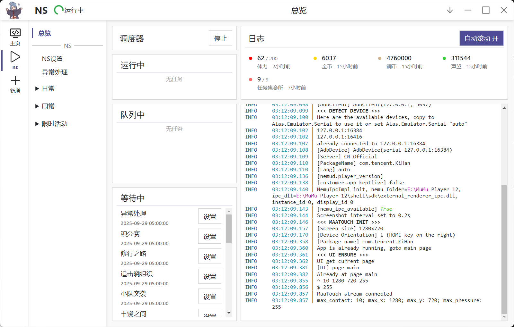

# NarutoScript
火影忍者手游自动化日常脚本   
如果觉得有帮助，请帮我点个 ⭐ Star 支持一下吧

## 核心功能
- [x] **日常**：小队突袭，丰饶之间，组织祈福，生存试炼，装备扫荡，任务集会所，秘境挑战，商店购买等
- [x] **收获**：招财，情报社，排行榜，活跃度宝箱，每月签到，忍法帖，每日分享，邮件，赠送体力，招募等
- [x] **周常**：修行之路，追击晓组织，叛忍来袭，组织要塞，天地战场
- [x] **限时活动**：丁次烤肉，樱花季
- [x] **数据面板**:金币，铜币,任务集会所等显示

## 设置
- **分辨率**：1280×720（理论支持所有16:9分辨率，未全面测试）
- **决斗场**: 关闭决斗场只匹配玩家
- **角色显示**: 隐藏称号、名字 +  仅显示自己 (避免遮挡)
- **键位**: 不要修改位置，用默认的键位

## GUI预览

## 如何上报bug How to Report Bugs
QQ群 921572302  
在提问题之前至少花费 5 分钟来思考和准备，才会有人花费他的 5 分钟来帮助你。"XX怎么运行不了"，"XX卡住了"，这样的描述将不会得到回复。

- 在提问题前，请先阅读 [常见问题 (FAQ)](doc/faq.md)。
- 检查 NarutoScript 的更新和最近的 commit，确认使用的是最新版。
- 上传出错 log，在 `log/error` 目录下，以毫秒时间戳为文件夹名，包含 log.txt 和最近的截图。若不是错误而是非预期的行为，提供在 `log` 目录下当天的 log 和至少一张游戏截图。
## TODO
- [ ] 小队突袭开倍
- [ ] 体力购买
- [ ] 微信分享
- [ ] 更多玩法
- [ ] 情报社奖励全拿
- [ ] 积分赛战斗

## 相关项目

NarutoScript 基于 Alas 生态开发，以下项目可供参考：  
👉 [AzurLaneAutoScript](https://github.com/LmeSzinc/AzurLaneAutoScript) - 碧蓝航线自动化脚本  
👉 [StarRailCopilot](https://github.com/LmeSzinc/StarRailCopilot) - 星铁速溶茶，崩坏：星穹铁道脚本，基于下一代Alas框架  
👉 [OnnxOCR](https://github.com/jingsongliujing/OnnxOCR) - OCR

## 许可证

本项目遵循 [GPLv3 许可证](LICENSE) 开源，允许非商业场景下的自由使用、修改与分发，使用前请仔细阅读许可条款。

---

如有功能建议、BUG 反馈或开发合作意向，欢迎提交 Issue 或 Pull Request，我们会尽快响应。
